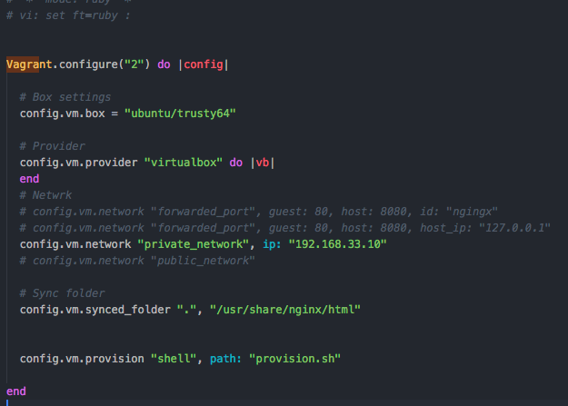

# Creating a web server using vagrant and nginx
------
This Readme contains basic info on how you can create a web server using vagrant while managing your VMs with virtual box. 
I'll also show you how you could sync files from your host machine to your VM(guest machines).


### Vagrant Nginx server
------
The steps for setting up a webserver such as nginx on your guest machine are pretty straight forward

###### Prerequisites 
- ###### Virtual box 
  Virtual box is a virtual machine manager that allows you to emulate an operating system on your computer and use it like it's running on a real device hardware. Your can download it [here](https://www.virtualbox.org/wiki/Downloads)

- ###### Vagrant
  Vagrant is a tool for managing virtual machines environments, it focuses on automation and lowers development environment setup time. Learn more about it [here](https://www.vagrantup.com/)


Now assuming you have **[Vagrant](https://www.vagrantup.com/)** and **[Virtual box](https://www.virtualbox.org/wiki/Downloads)** installed

- Create a directory `e.g vagrant_enginx_demo`

- Open terminal and `cd ` into `vagrant_enginx_demo`

- Run `vagrant init` this should get the directory initialized with a vagrant file, your file show look like the image below.


Wow, that's a lot going on there! Now we're going to make changes to the config file, by uncommenting the things we need and clean up the others.

 
This looks more appealing, your configuration show look similar to this. I'm going to explain to you what each line does


- ###### config.vm.box
  The `config.vm.box` method helps vagrant identify the Operating System you want to use on your machine of which in our case is `"ubuntu/trusty64"`

- ###### config.vm.network
  For the network part, this is how our host sees our box(OS), so vagrant already exposes us to some high-level networking options for stuffs like forwarded ports(these forwarded ports then allows you to access a port on your host machine and have all data forwarded to a port on the guest machine, over either TCP or UDP)
  For example: If the guest machine is running a web server listening on port 80, you can make a forwarded port mapping to port 8080 (or anything) on your host machine. You can then open your browser to localhost:8080 and browse the website, while all actual network data is being sent to the guest.

  But in my case I’m using a private networks which allows you to access your guest machine by some address that is not publicly accessible from the global internet. In general, this means your machine gets an address in the private address space.
- ###### config.vm.synced_folder
    Synced folders enable Vagrant to sync a folder on the host machine to the guest machine, allowing you to continue working on your project's files on your host machine, while using the resources in the guest machine to compile or run your project.
- ###### config.vm.provisioning
  Provisioners in Vagrant allow you to automatically install software, alter configurations
  This is useful since boxes typically are not built perfectly for every use case. Of course, this is the reason why we’re using vagrant in the first place, we don’t to ssh into the box and type every installation commands for the environment running in.
  The `"shell"` provisioner allows you to upload and execute a script within the guest machine.


- Run `vagrant up` this will download all the necessary dependencies for your VM to run successfully
## Installing Nginx
---
Now that your ubuntu OS is running, let's install `nginx`. First off, there are two ways we could install nginx, we could just run `vagrant ssh` && `sudo apt update` && `sudo apt install nginx`, but that's defeats the entire idea of automation.


#### Automating the proccess
Notice that on the `config.vm.provision` method there's a path to a file name `provision.sh`, this file will contain the commands we'll run once the OS is booted.

So, create a file on your root directory called `provision.sh` then add the following commands to it.
```
apt-get -y update
apt-get install -y nginx
service nginx start
```
This script will `install` and `start` the nginx server.

- With all that done, run `vagrant up` 
- Run `vagrant ssh` to ssh into your guest machine
- Next run `sudo service nginx status ` to confirm the status of your nginx server
  You should get something like this 
  ```vagrant@vagrant-ubuntu-trusty-64:~$ sudo service nginx status
  * nginx is running

  ```
  else run `vagrant provision` this command will make sure  the `provision.sh` script runs.

- Once you've successfully logged into your guess machine, verify the `document root` for your webserver as this would be the directory for serving your apps. You can do that using this command `grep "root" -R /etc/nginx/sites-enabled`

- After you locate your document root, on your ` config.vm.synced_folder ".", "/usr/share/nginx/html"`  method, replace `"."` with path to your project files and replace `"/usr/share/nginx/html"` with your `nginx document root`(It might be the same with mine though)
  **Note:** I've already explained what the ` config.vm.synced_folder` does above

With all these setup, let's try to access the guest machine from our computer, goto whatever network you're using, which in my case is a private network. Your guess machine should be able to serve your files from your host.

So that's pretty much a beginner's guide to creating a webserver on a vagrant.